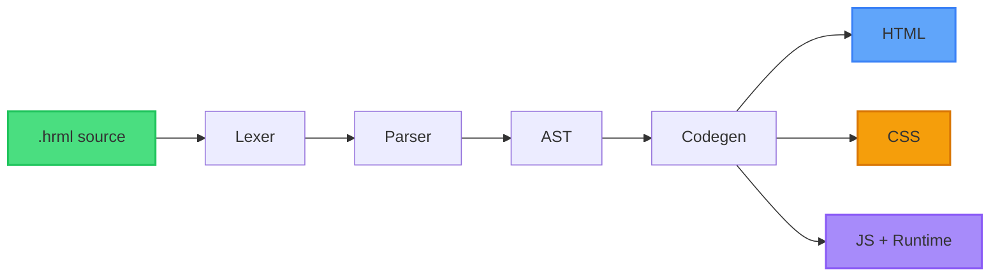
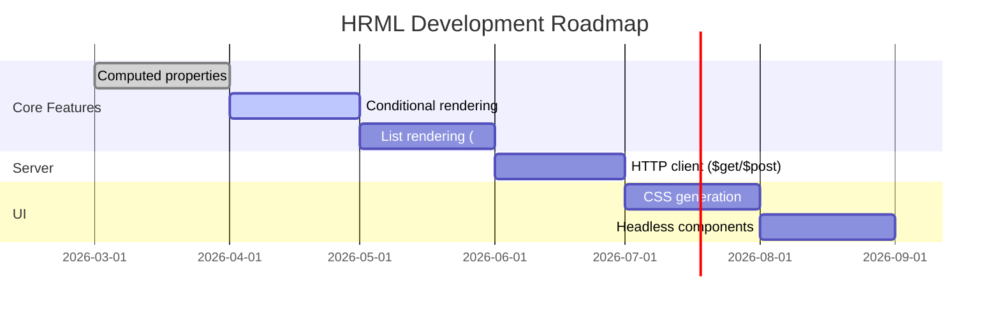

# HRML

[](https://opensource.org/licenses/MIT)
[](https://www.rust-lang.org/)
[](https://github.com/mendexio/hrml/releases)

**Hypertext Reactive Markup Language** - A compiled web language. Three symbols replace React, Vue, and Angular.

The Rust compiler runs as CLI and WebAssembly - directly in your browser.

## Try it

**[Playground](https://hrml.dev/playground)** - Write HRML, see it compile to HTML + JS in real time. No install. No signup.

## Example

```hrml
state
  count: 0

div .counter
  button @click="count--" "-"
  span "{count}"
  button @click="count++" "+"
```

Compiles to:

```html
<div id="hrml-0" class="counter">
  <button id="hrml-1">-</button>
  <span id="hrml-2"></span>
  <button id="hrml-3">+</button>
</div>
<script>
  // Reactive runtime (~200 lines, zero dependencies)
</script>
```

## Three symbols

| Symbol | Purpose | Example |
|--------|---------|---------|
| `:` | State & directives | `:show="visible"` |
| `@` | Events | `@click="count++"` |
| `$` | Server communication | `$get="/api/data"` |

## Architecture



**Compilation Pipeline:**

```
.hrml source → Lexer → Parser → AST → Codegen → HTML + CSS + JS
```

The compiler is a Rust workspace with 5 crates:

| Crate | Purpose |
|-------|---------|
| `hrml-lexer` | Tokenization with indentation tracking |
| `hrml-parser` | Recursive descent parser + Pratt expression parser |
| `hrml-codegen` | HTML, CSS, and JS code generation |
| `hrml-wasm` | WebAssembly bindings via wasm-bindgen |
| `hrml-cli` | Command-line interface |

## Build

```bash
# Run tests (264 tests, 0 warnings)
cargo test

# Build CLI
cargo build --release

# Build WASM (requires wasm-pack)
cd crates/hrml-wasm && wasm-pack build --target web --release
```

## CLI usage

```bash
# Compile a file
hrml build examples/counter.hrml

# Check for errors
hrml check examples/counter.hrml
```

## Status

This is a pre-release prototype. The compiler supports a subset of the HRML language - enough for the three examples in the playground.

### What works

- **State declarations** - `state count: 0` creates reactive state
  ```hrml
  state
    count: 0
    visible: true
  ```

- **Element syntax** - indentation-based, classes via `.className`
  ```hrml
  div .container
    h1 .title "Hello"
    p .text "World"
  ```

- **String interpolation** - `"{variable}"` for reactive text
  ```hrml
  span "Count: {count}"
  ```

- **Event handlers** - `@click`, `@input`, etc.
  ```hrml
  button @click="count++" "Increment"
  ```

- **State directives** - `:show`, `:model` for conditional display and two-way binding
  ```hrml
  div :show="visible" "Only visible when true"
  input :model="username"
  ```

- **Reactive runtime** - Proxy-based, zero dependencies, ~200 lines
- **WASM compilation** - 68KB gzipped, runs in browser

### Roadmap



**Next milestones:**
- [ ] Computed properties (`computed fullName: firstName + " " + lastName`)
- [ ] Conditional rendering (`:if` / `:else` / `:else-if`)
- [ ] List rendering (`:each="item in items"`)
- [ ] Server communication (`$get="/api/data"`, `$post`)
- [ ] CSS generation (utility-first, tree-shaking)
- [ ] Headless components (modal, dropdown, tabs, etc.)

## License

[MIT](LICENSE) - Mendex
